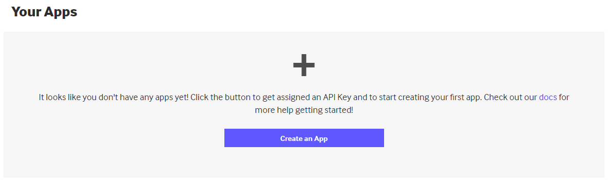
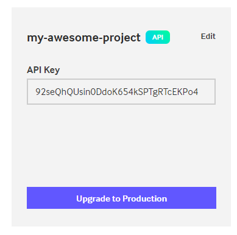

# Giphy

_JavaScript Web Teamwork Assignment - **Gifs SPA Application**_

### 1. Project Descriptio

Design and implement a Gifs SPA application for searching and sharing funny gifs with your friends. The application should be able to display the top trending gifs, upload gifs and much more! For our purposes we are going to use the [**Gyphy API**](https://developers.giphy.com/docs/api/#quick-start-guide)

</>

### 2. Project information

- Language and version: **JavaScript ES2020**
- Platform and version: **Node 14.0+**

</>

### 3. Step-by-step Guide

1. To use the **Giphy API**, first we need to register. Go [**here**](https://giphy.com/join?next=%2Foauth%2Fauthorize%2F%3Fresponse_type%3Dcode%26client_id%3DC7yftGDVCAhmaTnJCKv3eNaRsANYTDDf7PA9jZbw%26redirect_uri%3Dhttps%253A%252F%252Fpartner-hub-api.giphy.com%252Fapi%252Fv1%252Flogin%253Fredirect_uri%253Dhttps%253A%252F%252Fdevelopers.giphy.com%252F) and register to **Giphy**.
2. After you registered successfully, the next thing we want to do is to [**create an app**](https://developers.giphy.com/dashboard/). By creating an app, Giphy will provide us with an **api_key** that we are going to need in our future requests.

   
3. Select the **API** product and name your app
4. After you successfully created an app, you should have obtained an **api_key** for that app. Now we can get to work!

   
5. Consume the [**Giply API Endpoints**](https://developers.giphy.com/docs/api/endpoint/#search) in order to retrieve and store the gif data you want.

</>

### 4. Functional Requirements

Each requirement is categorized in one of three categories – must, should or could.

* Must requirements have the highest priority and should be addressed first.
* Should requirements have medium priority and should be addressed after all or most must requirements have been implemented and tested.
* Could requirements should be left for last.

Any additional features are welcome, if you have covered all the listed requirements below.

#### 4.1. Must Requirements

The application must support the following functionalities:

---

##### Display Trending Gifs

The application must have a **display trending gifs** functionality, that will allow the user to see the top trending gifs. You should use the [**trending endpoint**](https://developers.giphy.com/docs/api/endpoint/#trending) with your api_key. You can limit the received gifs, by using the limit parameter.

##### Search Gifs

The application must have a **search gifs** functionality, that will allow the user to search gifs by a given **query.** You should use the[ **search endpoint**](https://developers.giphy.com/docs/api/endpoint/#search) with your **api_key** and a search query– **q**, provided by the user. You can **limit** the received gifs, by using the limit parameter.

##### Display Gif Details

The application must have a **display gif details** functionality, that will allow the user to see a given gif’s detailed information like uploaded user’s username. You should use the [**get-gif-by-id endpoint**](https://developers.giphy.com/docs/api/endpoint/#get-gif-by-id) with your **api_key** and the desired gif’s id – **gif_id.**

##### Upload Gif

The application should have an **upload gif** functionality, that will allow the user to upload a gif from his file system. You should use the **[upload endpoint](https://developers.giphy.com/docs/api/endpoint/#upload)** with **POST request,** containing your **api_key** and in the request’s body you should send a **file** object as a [**form data**](https://developer.mozilla.org/en-US/docs/Web/API/FormData). You can see the uploaded gifs in your [**Giphy Channel**](https://giphy.com/explore/channel).

#### 4.2. Should Requirements

This application should support the following functionalities:

---

##### Display Uploaded Gifs

The application should have a **display uploaded gifs** functionality, that will allow the user to see his uploaded gifs. You can do this by storing the ids of the uploaded gifs in the browser’s[ **local storage**](https://www.w3schools.com/jsref/prop_win_localstorage.asp) and then use the [**get-gifs-by-id endpoint**](https://developers.giphy.com/docs/api/endpoint/#get-gifs-by-id) with your **api_key** and the desired ids, separated by commas – **ids.**

##### Favorite Gif

The application should have a **favorite gif** functionality, that will allow the user to make a gif his favorite and display it somewhere in the app. If the user hasn’t chosen a favorite gif yet, he should be notified, and a random gif will be shown as a favorite. You can do this by storing the chosen favorite gif’s id in the browser’s [**local storage** ](https://www.w3schools.com/jsref/prop_win_localstorage.asp)and then use the [**get-gif-by-id endpoint**](https://developers.giphy.com/docs/api/endpoint/#get-gif-by-id) and if the user has no favorite gif yet, you can use the[ **random endpoint**](https://developers.giphy.com/docs/api/endpoint/#random).

### 5. General Requirements

* You must use **Native DOM API** for DOM manipulations.
* You must use **Git** to keep your source code and for team collaboration.
* You must use **GitHubs** issue tracking system.
* You must use **ESLint** to write consistently styled code.
* You must use **modules** and they should be single-responsible.
* You must document your code explicitly following the **JSDoc standard.**
* You must use correct naming and write clean, self-documenting code.
* You must have usable user interface.
* You must use the latest features of **ECMAScript.**
* You could use external libraries such as Bootstrap, Materialize or other to style your project.
* External libraries such as jQuery UI, Kendo UI or other for custom controls are allowed.

### 6. Teamwork Guidelines

Refer to the teamwork guidelines document found along with the project requirements.

### 7. Give Feedback about Your Teammate

You will be invited to provide feedback about all your teammates, their attitude about this project, their technical skills, their team working skills, their contributions to the project, etc. **The feedback is an important part of the project evaluation, so take it seriously and be honest.**
